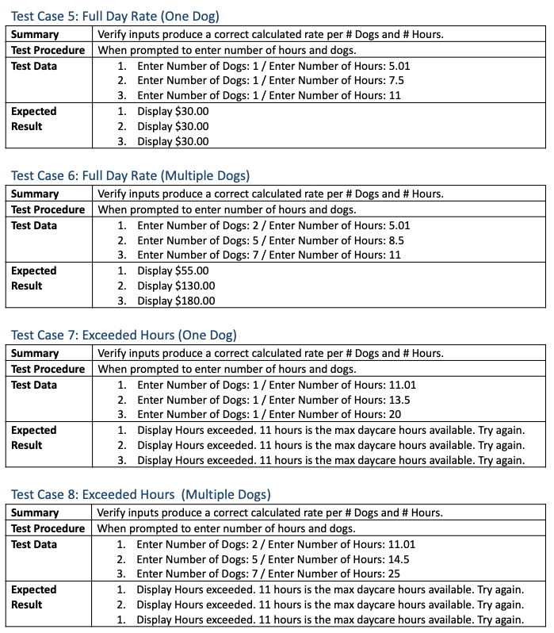
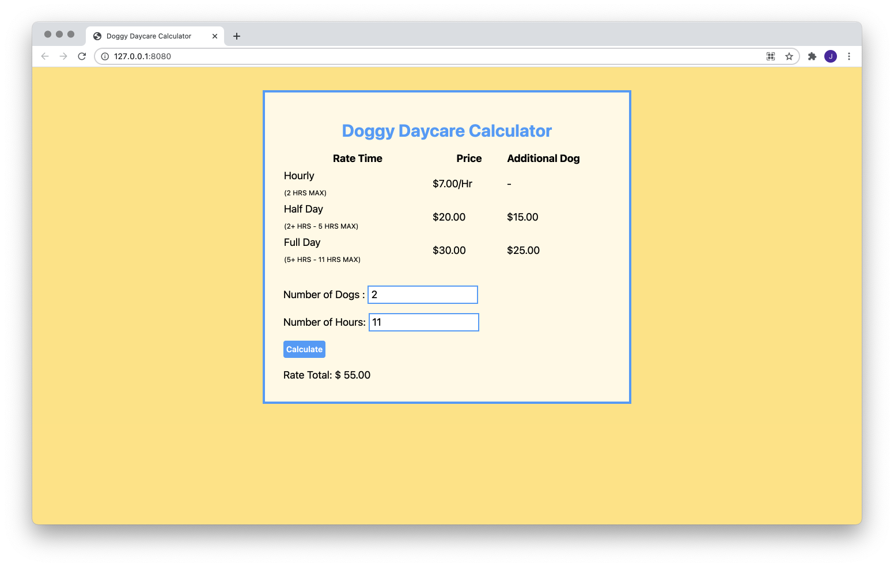
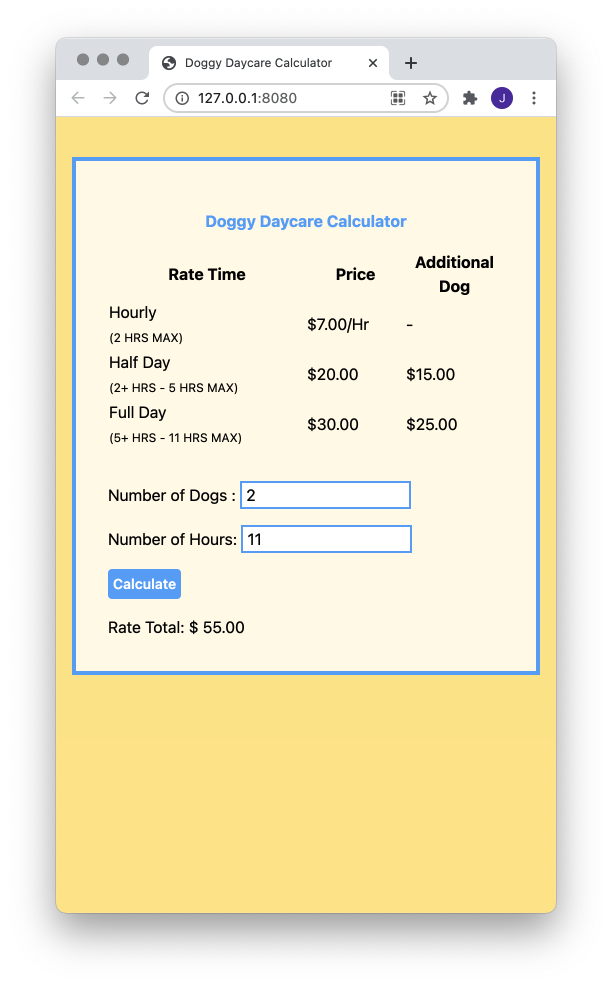

# Doggy Daycare Calculator
**Created By:** Jessica Cassidy

A doggy daycare calculator that calculates total rates based on number of dogs and hours entered by a user. The hours correspond to the Hours Rate Type: hourly, half day, and full day rates.\
(See Python Version: https://github.com/cassjsdev/python_projects/blob/master/doggy_daycare_calculator/README.md)

| Rate Time                        | Price       | Additional Dog |  
| -------------------------------- | ------------| ---------------|
| Hourly (2 Hrs Max)               | $ 7.00/Hr   |    -           |
| Half Day (2+ hrs - 5 hrs max)    | $ 20.00     | $ 15.00        |
| Full Day (5+ hrs - 11 hrs max)   | $ 30.00     | $ 25.00        |
## Test Cases:
System tests using black-box testing of all functions of the program. Valid and invalid inputs are tested.\
\

## Preview:

