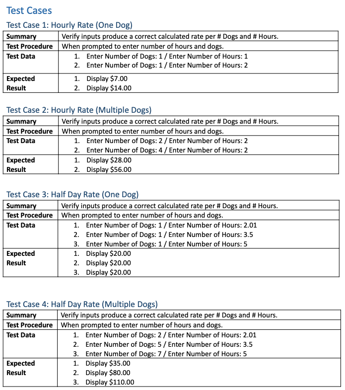
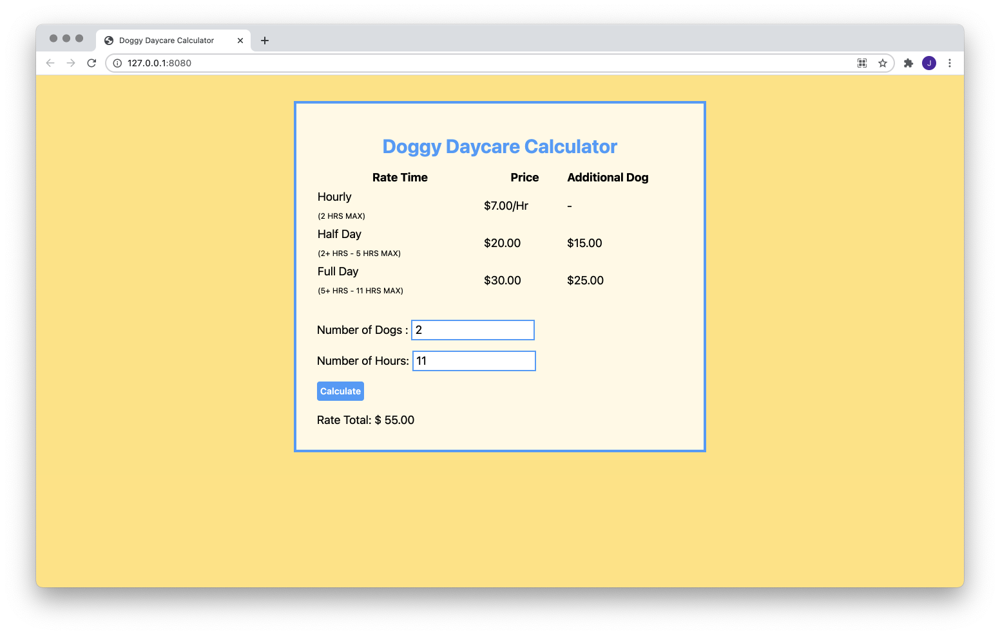

# 🐶 Doggy Daycare Calculator

A doggy daycare calculator that calculates total rates based on number of dogs and hours entered by a user. The hours correspond to the Hours Rate Type: hourly, half day, and full day rates.

| Rate Time                        | Price       | Additional Dog |  
| -------------------------------- | ------------| ---------------|
| Hourly (2 Hrs Max)               | $ 7.00/Hr   |    -           |
| Half Day (2+ hrs - 5 hrs max)    | $ 20.00     | $ 15.00        |
| Full Day (5+ hrs - 11 hrs max)   | $ 30.00     | $ 25.00        |

[See Python Version](https://github.com/cassjsdev/python_projects/blob/master/doggy_daycare_calculator/README.md)

## Build
- **Language:** JavaScript
- **Styling:** Tailwind-CSS
- **Deployment:** Netlify (Continuously deployed)

## Features
- Areas to input user values
- Calculated output result shows via click of a button 
- Responsive styling viewable on mobile or desktop devices
- Build bash script automates build in development and opens port for live editing
- Deployed via Netlify w/ continuous deployment via Github repo

## Test Cases
System tests using black-box testing of all functions of the program. Valid and invalid inputs are tested.

\

## Preview

